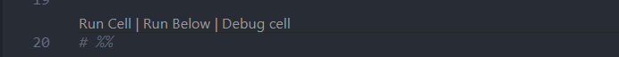

# Deep Learning in Tongji University

### Overview

This is the course materials for Deeplearning in Tongji university.

Some course materials and tutorials are from TA Bingchen Zhao.

The solutions for assignments are placed in the folder with corresponding name.

My work is summarized in each python script as Doc-Strings and they are also presented below.

To run the codes, please start VS code from the folder `DLcourse`, or you may have to modify some path variables.

In VS code, you can click "Run Cell" to activate built-in jupyter interactive window.



You may also start jupyter lab from `DLcourse`

### Assignment1

```
# Taks1_LinearRegression

This file presents a procedure that trains a linear
regression model to predict the published relative performance (PRP)
of a CPU, using 8 features from the Computer Hardware Dataset.

Importing packages and loading data with pandas completes before
the data processing begins. 
Then comes data encoding, in which non-numerical
features are mapped into the non-negative integer space.
After that, all data are transfered into numpy.array and split into 
training set (70%) and testing set (30%) randomly.
A gradient descent method is developed to train a parameter vector 
that minimizes the MSE of the training set.
The latest 5 training errors are examed every 50 epoch, and learning
rate will be lowered when training error almost converges.
The trained model has a testing error at around 2643.
Besides, the algebraic solution for the regression task is also
calculated for comparison and its testin error is 2634.
```

```
#Task2_LogisticRegression

This file creates a multi-class classifier for the Glass identification 
dataset using logistic regression and gradient descent.

A multi-class classifer can be decomposed into multiple binary classifer,
so the codes are just wrapped like that.
This task seems quite difficult, because the scatter plot of the data points
are highly tangled...
The overall accuracy is 66.154%

The low accuracy may reslut from inadequate or improper features, which leads to these discussions:

Class 1~4 involves the jargon "float process", which is a technique to produce flat glass.
In float process, raw materials of glass are melt down and poured onto liquid stannum (Sn), 
and a dividing boundary forms between the material and Sn, just like oil and water. We can get 
a piece of flat glass though it. If we know the proportion of Sn in the glass, the model may be 
more confident to classify the two process techniques.

Reflective index (RI) belongs to optical features, but we may also want to know the clearness 
and color of each type of glass, since they are more closely connected with the usage. 
For example, extra clean glass usually contains little Fe.

The usage of glass depends on both material and process, it will be better if we can know more 
about the process of those glass, e.g., tempered, surface enhancement and poly-organic-materials. 
But that seems to be cheating, since the task is to classify the progress based on element composition.
```

### Assignment2

#### mnistLoader.py

`loadAll()` wraps all functions in the script and returns trainData, validationData, and testData for mnist dataset. 
`labelOneHot()` encode the original label into one hot labels
`loadMNIST()` is a little bit naive, and returns a 2d matrix that contains all the data, but this runs rather slow...so, it is not utilized in `loadAll()`...instead, a faster version `fastLoadMNIST()` is used.

Note that the whole loading process takes 5 minutes or so.. and once complete, the data will be dumped using pickle.

#### Networks.py

Generally, this script contains a class `FCNet()` which is a fully connected network with softmax output. 

You may choose to initialize a single layer network with `oneLayerNet = Networks.FCNet((784,10), 'sigmoid')` in which the tuple `(784,10) `means the number of neurons in each layer, and 'sigmoid' is the type of activation function (you may also choose 'relu'). The parameters are randomly initialized.

After loading data and initializing the network parameters, you can use `net.gradientDescent()` to train the network, and `net.report()` to test the model on test data.


### Assignment3

#### Task.py

This script implements a convolutional neural network to classify images in cifar10 using pytorch.